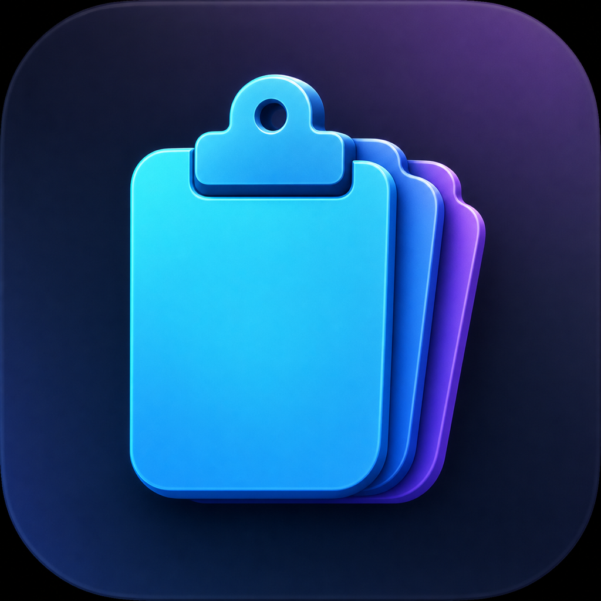
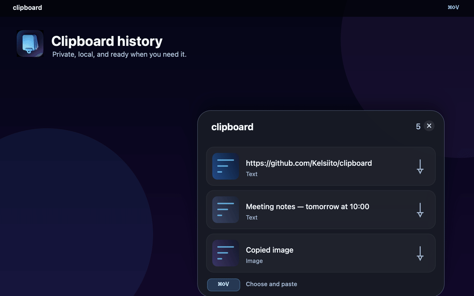

# clipboard

[](https://github.com/Kelsiito/clipboard/actions/workflows/macos.yml) [](LICENSE)

<p align="center">
  
</p>

<p align="center"><strong>Fast, native, open-source clipboard history for macOS.</strong><br>Everything stays on your Mac.</p>

<p align="center">
  
</p>

`clipboard` is a small, local-first clipboard history app for macOS. It lives in the menu bar and opens a compact Windows+V-style picker with `⌘⇧V`.

The project is source-first and intentionally simple: SwiftUI + AppKit, Apple frameworks only, no cloud, analytics, accounts, backend, or external runtime dependencies.

Project site: [clipboard-site-pi.vercel.app](https://clipboard-site-pi.vercel.app/)

> Status: public v1.2 privacy-controls milestone merged; v1.3 Clipboard Stack is in progress. The repository builds locally, but the app is not currently signed, notarized, or distributed through the Mac App Store. See the [release checklist](docs/release.md) for the distribution path.

## Features

- Menu-bar-only app; it does not add a normal Dock icon.
- Configurable global hotkeys: history defaults to `⌘⇧V`, GIF recording defaults to `⌘G`.
- Capture and annotate images from the menu-bar menu with the native macOS area selector.
- Lightweight screenshot editor with freehand drawing, lines, arrows, rectangles, undo, and clear.
- Record a selected screen area as an animated GIF and copy it directly to the pasteboard and history.
- Persistent history for plain text, RTF data, PNG/TIFF/JPEG images, and copied file references.
- Search-as-you-type across text, content kind, and file metadata.
- SHA-256 fingerprints to avoid duplicate history entries.
- 50 stored items by default, configurable from 10 to 200.
- Up to three pinned items, always shown first.
- Compact picker with three visible rows, scrolling for older items, search filtering, arrow-key navigation, `Enter` to paste, and `Esc` to close.
- `⌘1`–`⌘9` paste the matching visible picker item; context menus can delete individual items.
- Clipboard Stack captures subsequent copies in order, then lets you paste the next queued item one at a time.
- Click-outside, close-button, and paste-to-dismiss behavior.
- Smooth spring entrance animation.
- Native Liquid Glass surfaces on macOS 26, with a material fallback on macOS 14–25.
- Settings window for both hotkeys, history limit, clearing all or unpinned history, opt-in Launch at Login, and Accessibility status.
- `Ignore Next Copy` skips one eligible pasteboard snapshot without changing existing history.
- Privacy controls for ignoring selected applications, pausing capture for 15 minutes, 1 hour, or until resumed, and automatically removing old unpinned items after 1, 7, or 30 days.
- File bookmarks/references are stored locally; original files are never copied, moved, or deleted by the app.

## Requirements

- macOS 14 or newer.
- Xcode with a macOS SDK capable of building the project.
- A Mac where Accessibility permission can be granted if automatic paste is desired.
- Screen Recording permission may be required when using capture, annotation, or GIF recording.

The project uses Swift 5 mode and has no Swift Package Manager, CocoaPods, or other third-party dependencies.

## Install and run from source

```sh
git clone https://github.com/Kelsiito/clipboard.git
cd clipboard
open clipboard.xcodeproj
```

In Xcode:

1. Select the `clipboard` scheme and `My Mac` as the run destination.
2. Build and run.
3. Look for the clipboard icon in the menu bar. The app is an accessory/menu-bar app, so it is not expected to appear in the Dock.
4. Open `Settings…` from the menu-bar item to configure both hotkeys and the history limit.

The command-line equivalents are:

```sh
xcodebuild -project clipboard.xcodeproj -scheme clipboard -destination 'platform=macOS' test
xcodebuild -project clipboard.xcodeproj -scheme clipboard -destination 'platform=macOS' build
```

The local Debug build is unsigned and not notarized. macOS may show a trust warning when launching a build compiled on another Mac; build and run it from Xcode or approve it in System Settings as appropriate for your environment.

## Usage

1. Copy text, an image, or one or more files normally.
2. Press `⌘⇧V` to open the history picker.
3. Select an item with the mouse or arrow keys.
4. Press `Enter` or click an item to restore it to the pasteboard and paste it into the previously active app.

Use the pin button or an item's context menu to pin/unpin it. Image rows also expose an `Edit image` button that opens the annotation editor directly; copying the result creates a new history item. The picker shows up to three rows at once; scroll for older entries. The menu-bar menu contains `Capture and Annotate…`, `Record GIF…`, `Ignore Next Copy`, `Pause History`, `Start Clipboard Stack`, `Settings…`, and `Quit`. While recording, it also offers `Stop GIF Recording` and `Cancel GIF Recording`.

### Search and keyboard shortcuts

- Press `⌘⇧V`, then type immediately. Results filter without changing persisted history.
- Use `↑`/`↓` to navigate filtered results and `Enter` to paste.
- Use `⌘1`–`⌘9` to paste the corresponding visible result directly.
- Right-click an item for `Delete`, `Pin`/`Unpin`, `Paste`, and image editing actions.
- Use `Ignore Next Copy` when the next clipboard change should not enter history.
- Use `Pause History` from the menu bar or Settings when capture should stop temporarily.
- Choose ignored applications and a retention period in Settings. Ignored-app rules apply while those apps are the active source; retention removes only unpinned history.

### Clipboard Stack

1. Choose `Start Clipboard Stack` from the menu bar.
2. Copy each field in the order you want to paste it. Normal history capture continues as usual.
3. Choose `Finish Stack Capture` when the sequence is ready.
4. Focus the destination field and choose `Paste Next Stack Item` for each field. The selected item is restored to the pasteboard and pasted automatically when Accessibility is available; otherwise press `⌘V` manually before advancing.
5. Choose `Clear Clipboard Stack` to discard the remaining sequence.

The stack is session-only and is not persisted as a second copy of history. Each queued entry points to the existing local history item.

### Capture and annotate

1. Choose `Capture and Annotate…` from the menu-bar menu, or click `Edit image` on an image in the history picker.
2. Select an area with the native macOS capture selector.
3. Draw freehand or add a line, arrow, or rectangle in the editor.
4. Choose `Copy to Clipboard` to copy the finished PNG and add it to local history.

The original capture is kept in a temporary file only while the editor opens. Cancelling does not add an image to the clipboard or history. The app does not replace or assume any macOS screenshot shortcut; those shortcuts remain controlled by each user's System Settings.

macOS may request Screen Recording permission the first time capture is used. The clipboard history and annotation editor remain local and do not upload screenshots.

### Record GIF

1. Choose `Record GIF…` from the menu-bar menu.
2. Drag over an area with the clipboard selection overlay and release the pointer; recording starts immediately.
3. Press the GIF hotkey again (`⌘G` by default) or choose `Stop GIF Recording` from the menu bar when finished. Use `Cancel GIF Recording` to discard it.
4. The app converts the temporary video locally, places the GIF on the pasteboard, and adds it to history.
5. Press `⌘V` in the target app.

The GIF is converted at 10 fps, capped at 1280 px wide. The temporary video is removed after conversion or cancellation. Local GIF export uses a separate future action; this flow is optimized for immediate paste.

### Accessibility and positioning

Accessibility is requested only when needed. It enables two things:

- reading the focused text role and caret/selection bounds so the picker can open beside the active field;
- restoring the target app and sending `⌘V` for automatic paste.

If Accessibility is denied, the history picker still works and the selected item remains on the clipboard for a manual `⌘V`. Apps that do not expose a real editable text element use a deterministic window-area fallback instead of the mouse position. The Codex desktop app is one such case: macOS exposes its content as a full-window accessibility group, so `clipboard` anchors near the lower composer area rather than claiming an exact caret that it cannot read.

To grant access, open `Settings…` in `clipboard`, choose `Open System Settings`, then enable `clipboard` under **Privacy & Security → Accessibility**. The status in the settings window updates while the app is running.

## Privacy and local storage

Clipboard history can contain sensitive information. `clipboard` keeps it on the local Mac:

- History is stored at `~/Library/Application Support/clipboard/history.json`.
- The app creates its data directory with restrictive permissions and writes the history atomically.
- Text, rich-text data, image payloads, and GIF payloads are stored locally in the history file.
- Copied files are represented by local security-scoped bookmarks/references; the original files are not copied into the history and are never deleted by clearing it.
- Concealed, transient, and autogenerated pasteboard entries are ignored.
- `Clear History` removes only data owned by `clipboard`; it does not empty the system pasteboard or delete source files.
- `Clear unpinned` preserves pinned entries and original files.
- `Ignore Next Copy` consumes one eligible clipboard snapshot; concealed, transient, autogenerated, and empty snapshots do not consume it.
- Ignored applications and paused capture never enter history and do not consume `Ignore Next Copy`.
- Retention removes only unpinned items older than the selected age. Pinned items and original files remain untouched.
- There is no sync, network service, account, telemetry, advertising, or analytics code in the app.

To remove all locally stored history, use `Clear History` in the settings window. To remove the app and its remaining support data manually, quit the app first and inspect the `~/Library/Application Support/clipboard/` directory before deleting it.

## Project structure

```text
clipboard.xcodeproj/             Native Xcode project
clipboard/                       App target
  clipboardApp.swift             Menu-bar scene and app lifecycle
  AppState.swift                 Hotkey, settings, paste orchestration
  PasteboardMonitor.swift        Pasteboard polling and filtering
  ClipboardStore.swift           Local persistence, dedupe, limits, pins, deletion
  Models.swift                   Codable history and hotkey models
  GlobalHotKey.swift             Carbon global hotkey registration
  ClipboardPanelController.swift Picker window, placement, and paste UI
  SettingsView.swift             Settings UI and Liquid Glass helpers
  ScreenshotCapture.swift        Native area-capture process and temporary-file lifecycle
  AnnotationEditor.swift         Screenshot markup UI and PNG rendering
  ScreenGIFRecorder.swift        Native screen recording and local GIF export
clipboardTests/                  XCTest coverage for core behavior
docs/                            Roadmap and implementation history
.github/workflows/               macOS test/build CI
```

## Development and validation

There are no generated dependencies to install. Make a focused change, run the unit tests and build, then manually check the affected macOS behavior.

```sh
xcodebuild -project clipboard.xcodeproj -scheme clipboard -destination 'platform=macOS' test
xcodebuild -project clipboard.xcodeproj -scheme clipboard -destination 'platform=macOS' build
git diff --check
```

The test suite covers persistence, image payloads, file bookmarks, deduplication, limits, pinning, deletion, clear-unpinned behavior, search, ignore-next-copy behavior, ignored applications, pause state, retention, empty/legacy data, annotation rendering, GIF encoding, hotkey defaults, and panel placement geometry. See [CONTRIBUTING.md](CONTRIBUTING.md) for the manual QA checklist and contribution rules.

## Known limitations

- Automatic paste and exact caret positioning depend on macOS Accessibility permission and on the target app exposing a standard editable text role.
- Electron/WebView apps may expose only a window or group; the fallback can target the composer area but cannot know an unavailable caret coordinate.
- File bookmarks can become stale if the original file is moved, deleted, or made inaccessible.
- New capture and annotate is started from the menu-bar menu; existing static images can also be edited from the history picker. It does not replace macOS screenshot shortcuts.
- GIF capture is intended for short clips; output is sampled at 10 fps and capped at 1280 px wide.
- Local GIF file export is not included yet; GIF recording is optimized for immediate paste.
- Clipboard Stack currently advances through the menu bar one item at a time; a dedicated stack hotkey and batch controls remain future work.
- The current project does not provide cloud sync, signing, notarization, or App Store packaging. These remain tracked in the [roadmap](docs/roadmap.md).
- Builds from source are currently unsigned and should be treated as development builds.

The planned follow-up work is tracked in [docs/roadmap.md](docs/roadmap.md).

## Roadmap and community

- [v1.1 Core usability milestone](https://github.com/Kelsiito/clipboard/milestone/1)
- [GitHub Discussions](https://github.com/Kelsiito/clipboard/discussions) for questions and product feedback
- [Issues](https://github.com/Kelsiito/clipboard/issues) for reproducible bugs and focused proposals
- [Contributing guide](CONTRIBUTING.md) for local development and pull requests
- [Release checklist](docs/release.md) for DMG signing, notarization, and Homebrew follow-up
- [Distribution issue](https://github.com/Kelsiito/clipboard/issues/9) for the signed DMG/Homebrew track
- [README demo-media generator](scripts/render-demo-gif.sh) for the privacy-safe synthetic preview above

## Contributing

Bug reports, focused fixes, documentation improvements, and UX feedback are welcome. Please read [CONTRIBUTING.md](CONTRIBUTING.md) before opening a pull request. Do not attach real clipboard history, private text, screenshots containing sensitive data, or credentials to issues or pull requests.

For security-sensitive reports, follow [SECURITY.md](SECURITY.md) instead of opening a public issue.

The application UI and repository documentation are English.

## License

`clipboard` is released under the [MIT License](LICENSE).
